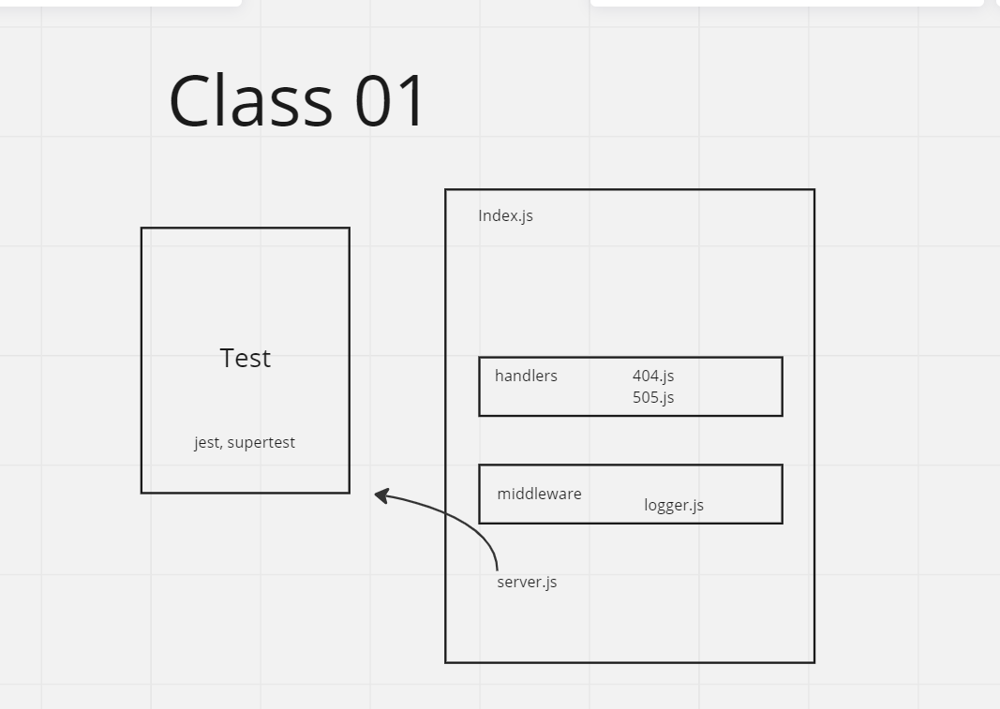

# LAB - Class 01

## Project: Server Deployment Practice

### Author: Jacob Dang

### Problem Domain
Building a web service with CI & CD to learn the basics of back-end Javascript and understanding servers

### Links & Resources
{GitHub Actions} {URL}
[prod deployment] {https://lab1-server-deployment-prod.onrender.com/}
[dev deployment]  {https://lab1-server-deployment-dev.onrender.com/}

see '.env.sample'

### Features/Routes:
- Feature One: Deploy to Dev
- GET : '/' -specific route to hit
- GET : 'bad' - specific route to hit
- Feature 2: Deploy to prod
- GET : '/hello' -specific route to hit
- GET : 'bad' - specific route to hit

#### Tests
- How do you run tests?
    - npm test
- Any tests of note
    - handles root path
    - handles invalid requests
    - handles errors

## UML
